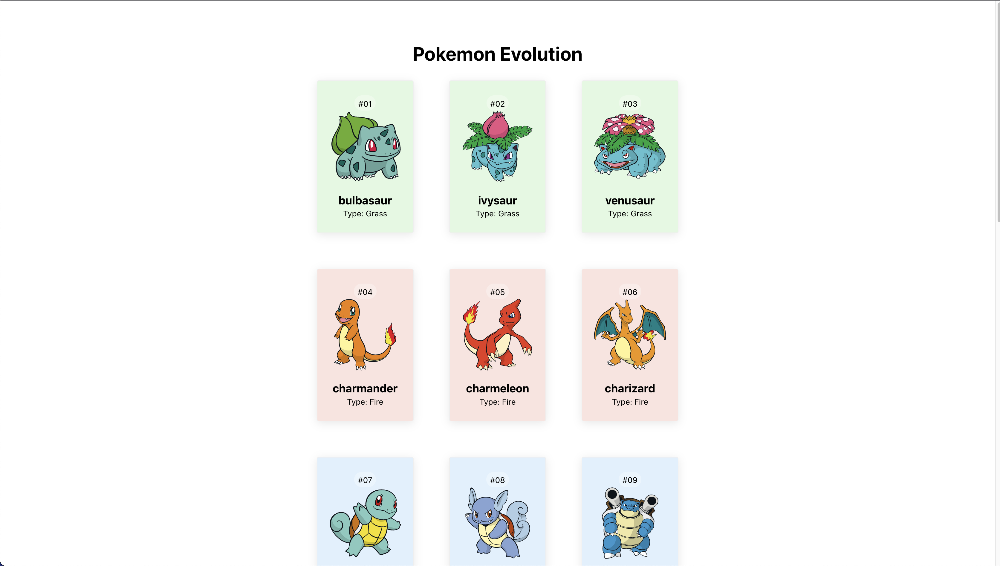

## What Lessons I learned in this project
- How to use API in React

- async/await - JavaScript Async
    There are three types of JavaScript Async:
    
    1: __Callback__  
    What is the concept?  
    JavaScript Callback literally means "Hey, I will call back later!"
    The callback function is a function which is to be executed after another function has 
    finished execution.
        
    When and how to use it?  
    You can use it when you want to use the specific function to end up. 
    Here is an example:
    ```javascript
        
        function displayResult(greeting) {
            document.getElementById("test").innerHTML = greeting;
        }

        function myFunc1(){
            displayResult("HI");
        }

        function myFunc2(){
            displayResult("Hello?");
        }
        myFunc1();
        myFunc2();

    ```
    This will end up displaying "Hello?". Because I called myFunc2() function at the end.
    If I change and call myFunc2() after myFunc1(), this will end up displaying "HI".

    This section is about sequence control.
    Sometimes you want to have good control over when a function is executed.
    I will show two examples and when to use the callback function below:
    ```javascript
        
        function displayResult(result) {
            document.getElementById("test").innerHTML = result;
        }

        function myCalc(num1, num2) {
            let sum = num1 + num2;
            return sum;
        }

        let result = myCalc(10, 12);
        displayResult(result);

    ```
    There is a problem above. I need to call two functions to see the result.   
    You also can create like:
    ```javascript
            
        function displayResult(result) {
            document.getElementById("test").innerHTML = result;
        }

        function myCalc(num1, num2) {
            let sum = num1 + num2;
            displayResult(sum);
        }
        
        myCalc(10, 12);
    ```
    But there is also a problem. I cannot prevent the myCalc() function from seeing the result. It is automatically displaying the result.     
    
    This is the right time to use the callback function!
    Here is an example below:
    ```javascript
            
        function displayResult(result) {
            document.getElementById("test").innerHTML = result;
        }

        function myCalc(num1, num2, myCallback) {
            let sum = num1 + num2;
            myCallback(sum);
        }
        
        myCalc(10, 12, displayResult);
    ```
    displayResult is called a callback function.   
    It is passed to myCalc() as an argument so that I do not need to call two functions as I showed before.   
    One thing you should be careful of is you do not need to add parenthesis which is ().   
    Not like:    
    myCalc( 10, 12, displayResult() );

    This will show undefined.


    2: __Asynchroous__  
          
    3: __Promises__  
          
    4: __Async/Await__  
        
        
- useState - React Hook 
- useEffect - React Hook


## Screenshot
